

# Prometheus

A general deep-learning vision task dataset procedure generation pipeline.

## Features
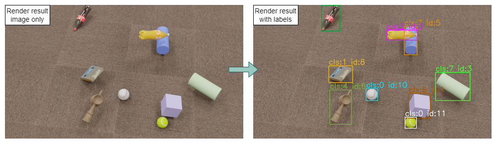

- Intergration in typical Blender workflow.
- Random for objects distribution, simple material, lighting, camera and objects movement.
- Manually scene creation support.
- Reproducible generation.
- Blender base function support.
- Annotation for 2D tacking and depth. (More for future update.)

## Installation

Blender versions before 4.2:

1. Download latest release with suffix `_addon`.
2. In Blender go to `Edit -> Preferences -> Addons`.
3. Press `Install...` and select the archive file.

Blender version 4.2 and later:

1. Download latest release with suffix `_extension`.
2. In Blender go to `Edit -> Preferences -> Get Extensions`.
3. Use the drop-down menu in the top right and press `Install from Disk` and select the archive file.

	Or install legacy add-ons in `Edit -> Preferences -> Add-ons` with latest release with suffix `_addon`.

## Usage
First, create a scene as typical blender media production workflow.

All contents for this addon are under `Properties -> Scene -> Prometheus Dataset Generation` panel.  If you can‘t find `Properties` panel: you can split a area by draging from a existing area window corners or go to topbar`Window` and press `new window` create a new area window, then press left top corner `Editor Type` and select `Properties`.

### General
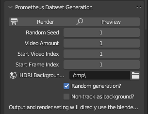

This is the main panel. Output setting will use Blender output panel setting in `Properties -> Scene -> Output`.

`Render` Button start render process.  
`Preview` Button go into preview to check your scene.

`Random Seed`: Seed to control random generation.  
`Video Amount`: How many video sequences you want to output.  
`Start Video Index`: Which video you want to start generation.  
`Start Frame Index`: Which farme you want to start generation.  

`HDRI Background Path`: The path of HDRI images stored that you want to use in this generation.

`Random generation? `: Check for all random generation.  
`Non-track as background? `: Check for all non-tracked objects as backgournd in rendering.

### Object
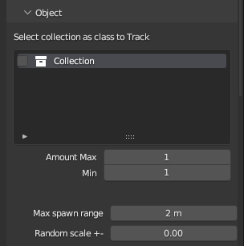

This panel is for objects you want to track.

It will list all collections in current scene. Each collection represents a category with collection name as category name. The check mark at front indicate this category collection will considered as "tagerts", otherwise it will be considered as "background". You should keep each category as a collection and move all objects in this category which you want track under it's collection. 

`Amount Max/Min`: Max/Min objects amount range in random generation for each video sequnce.  
`Max spawn range`: Target objects random spawn range in cube range which take (0,0,0) as center.  
`Random scale`: Random scale target objects additively in this +- scale range.

### Material
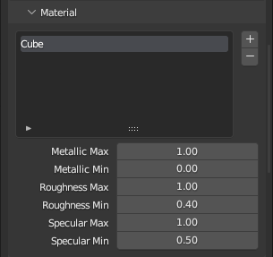

This panel is for simple material generation.

Press `+` button to add selected object in your scene, this object will give a generated basic principled BSDF material in rendering.  
Press `-` button to deleted selected list object form this list.

`Metallic Max/Min`: Max/Min Metallic range for this object material generation.  
`Roughness Max/Min`: Max/Min Roughness range for this object material generation.  
`Specular Max/Min`: Max/Min specular range for this object material generation.  

Base color will randomly generated.

Each object has its own individual setting.

### Light
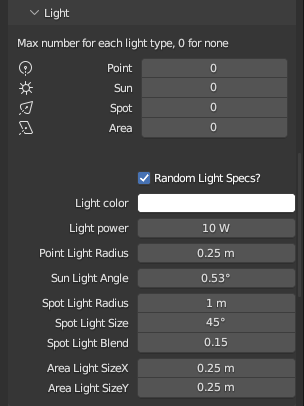

This panel is for random lights generation.

You can set max number in each video sequnce for all 4 light types in Blender.

`Random Light Specs?`: If this is true, all generated lights will ignore specs setting below and random set its specs.

`Light color`: For all light types. Set light color.
`Light power`: For all light types. Set light power.

`Point Light Radius`: Only for point light. Set point lights radius. Light size for ray shadow sampling.

`Sun Light Angle`: Only for Sun light. Set all sun lights angle. Angular diameter of the Sun as seen from the Earth.

`Spot Light Radius`: Only for point light. Set point lights radius. Light size for ray shadow sampling.  
`Spot Light Size`: Only for point light. Set point lights radius. For spot shape. Angle of the spotlight beam.  
`Spot Light Blend`: Only for point light. Set point lights radius. For spot shape. Softness of spotlight edge. 

`Area Light Size X/Y`: Only for area light. Set area light size x/y.

### Camera
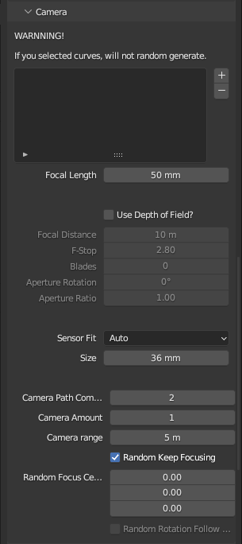

This panel is for camera setting.  
All camera used during the rendering will be generated by this panel setting.

In this list, press `+` to add selected bledner curve type object in your scene. Press `-` to delect selected curve in this list. All curves in this list will be used as camera moving pathes. If you want to have a fixed camera, you can set a short curve or signle node curve.  
If this list has no curve, will random generate camera path with setting below.

`Focal Length`: Set generated cameras focal length.

`Use Depth of Field?`: If ture to enable Depth of Field with setting as following.

`Sensor Fit`: Method to fit image and filed of view angle inside the sensor.  
`Size`: Sensor size in millimeters.

`Camera Path Complex`: How many node will be in generated camera movement path as bezier curve.  
`Camera Amount`: How many cameras will be generated each video sequence. All camera will set as active once for each frame to render multi view results.  
`Camera range`: Camera movement path random generate range in cube range which take (0,0,0) as center.

`Keep Focusing`: If ture, all cameras will keep focusing at point as random focus center below.  
`Focus Center`: Point for cameras to focus.  
`Rotation Follow Path`: If ture, all cameras will keep it rotation forward through its movement path.

### Physics
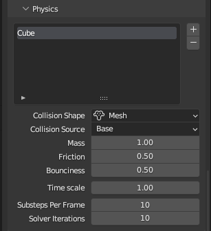

This panel is for enabling targets physics Rigid Body simulation in Blender.

In this list, press `+` to add object enable physics in rendering. Press `-` to delect selected object in this list. Each object has its own basic physics Rigid Body simulation setting.

`Collision Shape`: Collision Shape proxy of object in Rigid Body Simulations.
`Collision Source`: Source of the mesh used to create collision shape. "Base" - Base mesh. "Deform" - After all deformations(like shape keys, deform modifiers). "Final" - After all modifiers.

`Time scale`: Change the speed of the simulation.  
`Substeps per frame`: Number of simulation steps taken per frame (higher values are more accurate but slower).  
`Solver Iterations`: Number of constraint solver iterations made per simulation step (higher values are more accurate but slower).

Notice! All objects selected in this list will set as "Active" Rigid Body type. If you want those objects interact with background objects, you need to manually set those background objects in your scene as "Passive" type.

### Movement
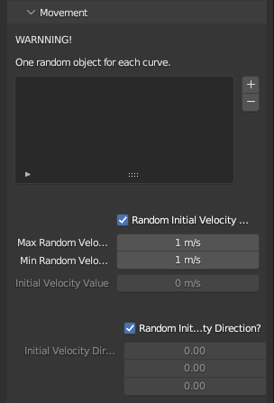

This panel is for simple movement generation. All generated targets objects will has movemnt.   
If you do NOT want target objects to move, just uncheck `Random Initial Velocity Value?` and set `Initial Velocity Value` to 0.

In this list, press `+` to add blender curve type object as object moving path in rendering. Press `-` to delect selected curve in this list. Each curve will randomly sign a object to follow this curve as movement path from video sequnce start to end.

`Random Initial Velocity Value?`: If ture, all objects will has a random initial velocity as following range.  
`Max/Min Random Velocity`: Max/Min range of initial velocity.
`Initial Velocity Value`: If `Random Initial Velocity Value?` is false, all objects initial velocity will be set as this value.

`Random Initial Velocity Direction?`: If ture, all objects initial velocity direction will be randomly set.  
`Initial Velocity Direction`: If `Random Initial Velocity Direction?` is false, all objects initial velocity direction will be set as this.

### Annotation
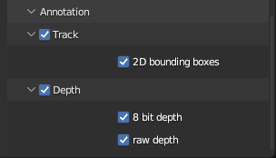

This panel is for generation annotation.

`Track`: To enable tack related annotaion.  
- 2D bounding boxes: 2D bounding boxes as format "`class` `id` `x_center/img_width` `y_center/img_height` `w/img_width` `h/img_height`".

`Depth`: To enable depth ralated annotaion.  
- 8 bit depth: 8 bit normalized single channel depth `PNG` image.  
- raw depth: raw 32 bit depth information in `OpenEXR` format.

## Example Scene

We offer two example scene：  
[Example_01](https://drive.google.com/file/d/1vnG076lLLGTF5wrX2DUQDsglNfGbrbl5/view?usp=sharing "Example Scene 1") [Example_02](https://drive.google.com/file/d/1kYRBmxxLFwRfF3Nh-46mAY2xnUaPlGMD/view?usp=sharing "Example Scene 2")

One with scaned our lab enviroument mesh as background and another with complex daily objects with HDRI.

Example Scene 1:  
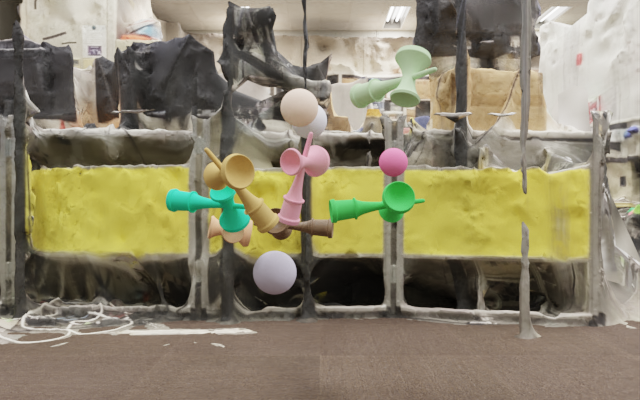

Example Scene 2:  
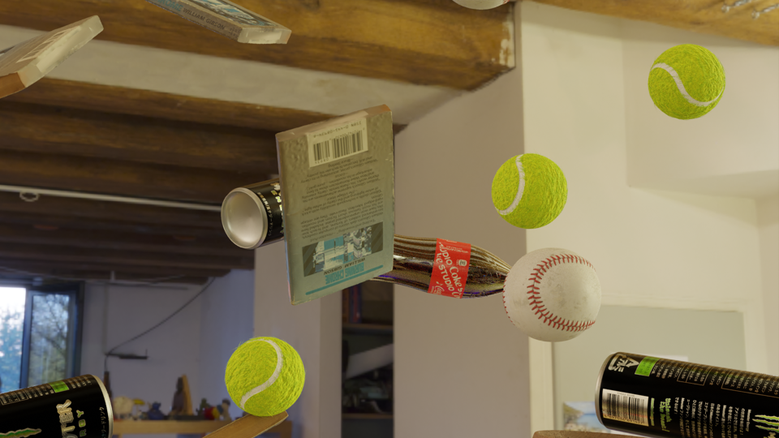